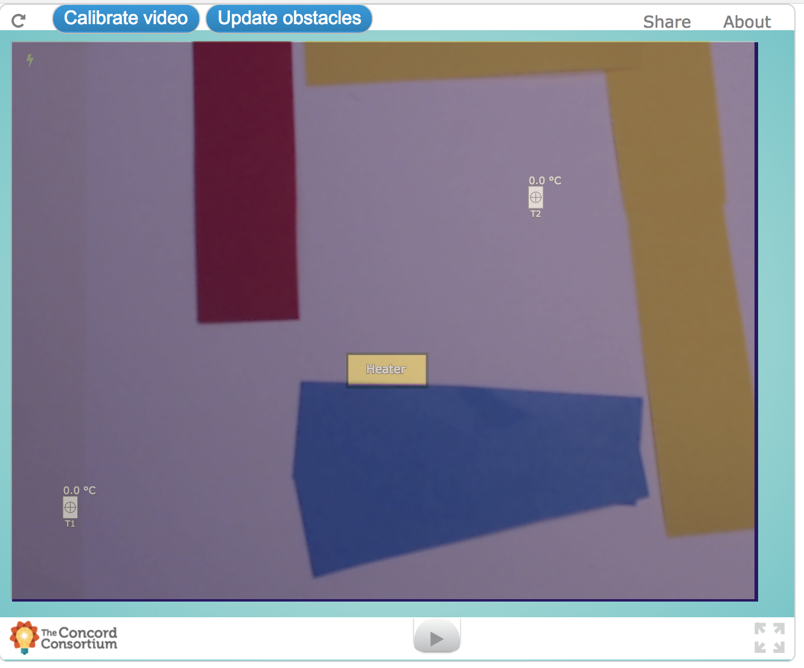
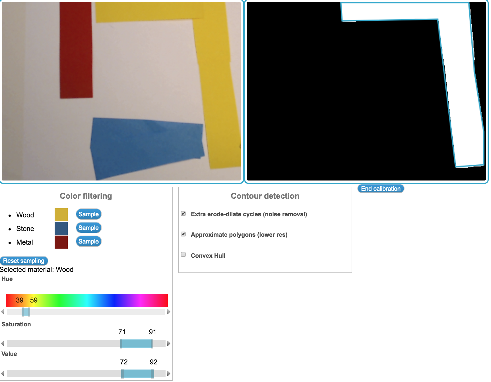

# Energy2D (Lab Framework) interactions using OpenCV in the browser

This experiment uses the opencv-node binding to allow us to send video
data (from WebRTC) to OpenCV running on the local server, and then
feeds the processed data to a [Lab](https://github.com/concord-consortium/lab) Energy2D model.

# Usage

# Hardware
You will need an external web cam, ideally with manufacturer software installed to enable simple zoom / pan to adjust the viewport of the camera.

# Software
Ensure that Python is installed, then open a terminal to the current directory

```
cd moore-demo
python -m SimpleHTTPServer
```

View the demo by navigating to `http://localhost:8000/`

You may be prompted for permissions the first time you visit the page to allow the application to access the web cam.

# Simulation Usage
On loading the simulation, click on `Calibrate Video` to open the window to enable calibration.



Once calibrated, click `Update obstacles` to update the detection of each type of material.



Once finished calibrating, click `Update Obstacles` before running the simulation.